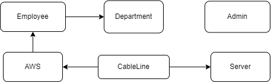

# Кабельный журнал

## Граф БД в виде диаграммы

Было решено добавить объединяющую таблицу CableLine, 
изначально все данные о кабеле хранились в AWS, что не отражало реальную архитектуру АРМ
и перегружало таблицу

## Запуск приложения
### Используемый стек

- Язык программирования: `Python 3.11.4`
- Основной фреймворк: `Streamlit 1.25.0`
- Библиотека создания базовых таблиц: `Pandas 2.0.3`
- База данных: `SQLite`
- ORM базы данных: `SQLAlchemy 2.0.20`
- Библиотека управления миграциями: `alembic 1.11.2`
- Библиотека для работы с окружением: `python-dotenv 1.0.0`

### Без докера:
1. Создайте venv: `python -m venv /path/to/core/venv` либо через IDE
2. Запустите команду установки зависимостей: `pip install -r core/requirements.txt`
3. Создайте в корневой папке файл `.env` и добавьте поля `LOGIN` и `PASSWORD`,
значения поставьте на свой вкус. Важен при первичном запуске для инициализации данных админа
в БД
4. Автоматически создается БД в `main.py`, но при необходимости 
можно применить начальную миграцию
`alembic revision — autogenerate -m “init”` и `alembic upgrade head`
5. И запуск приложения: `streamlit run core/main.py`

### С Докером:
1. Сборка образа: `docker build -t cablelog .`
2. Запуск контейнера: `docker run -e LOGIN=<login> -e PASSWORD=<password> -p 8501:8501 --name cabelog cablelog`  
Значения переменных окружения поставьте на свой вкус

## Структура проекта

- `core` - основная папка приложения, включаяющая весь функционал 
(было сделано для удобства работы с Докером)
- `core/dao/` - Data Access Object файлы для работы с базой данных
- `core/dao/DB/` - база данных и настройки подключения
- `core/dao/models.py` - описательные модели
- `core/migration/` - миграции Alembic
- `core/migration/env.py` - окружение Alembic, например, 
указание на базовую модель SQLAlchemy
- `core/pages/` - страницы Streamlit
- `core/alembic.ini` - настройки для Alembic, например, url до БД
- `core/main.py` - входная точка запуска приложения
- `.env` - обязательный файл с настройками переменных окружения 
LOGIN и PASSWORD, поэтому в случае локального запуска не забудьте его
добавить
- `Dockerfile` - скрипт сборки образа приложения в Docker